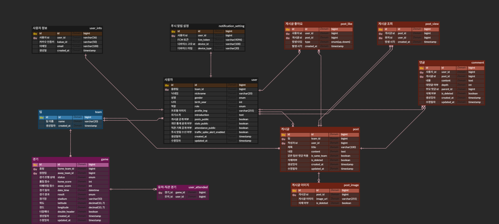

# ⚾ BBATTY

> 나의 응원이 팀의 승리로 이어지는 순간, 같은 기적을 경험한 팬들과 함께 나누세요

### SSAFY 13기 공통 프로젝트 403팀

## 🎯 프로젝트 소개

**BBATTY**는 **같은 팀을 응원하는 팬들끼리 소통**하고, **나만의 직관 통계**를 확인하며, **함께 응원할 메이트**를 찾을 수 있는 **야구팬 전용 플랫폼**입니다.

이제 야구팬들은 **GPS 기반의 직관 인증 시스템**을 통해 직관 승률을 자동으로 계산하고, 인증된 팬들만 참여할 수 있는 **실시간 직관 채팅**과 **응원 팀 기반 커뮤니티**에서 경기의 짜릿함을 함께 나누며, **직관 메이트 매칭 채팅**으로 다른 야구팬과 함께 응원하는 특별한 추억을 만들 수 있습니다.

**BBATTY**와 함께 **'승리요정'** 의 기적을 데이터로 증명하고 함께 만들어나가세요!

## 👥 팀 구성

### Frontend (3명)
- **하헌석** - 채팅, 직관 인증, 둘러보기
- **이은수** - 인증/인가, 마이페이지, 통계
- **황지민** - 커뮤니티, 푸시알림

### Backend (3명)
- **신해봄** - 인증/인가, 사용자 프로필, 직관인증, 통계, 푸시알림
- **이지민** - 채팅(직관/매칭), DevOps, 서버간통신
- **고세규** - 커뮤니티, 스케줄링, 크롤링

## 🛠️ 기술 스택

**Frontend**\

[](https://reactnative.dev/)
[](https://www.typescriptlang.org/)

**Backend**\

[](https://openjdk.org/)
[](https://spring.io/projects/spring-boot)\
[](https://hibernate.org/)
[](https://mysql.com/)
[](https://aws.amazon.com/s3/)\
[](https://redis.io/)
[](https://kafka.apache.org/)\
[](https://selenium.dev/)\
[](https://aws.amazon.com/ec2/)
[](https://docker.com/)
[](https://jenkins.io/)

**협업 도구**\
[](gitlab-link)
[](notion-link)
[](figma-link)

## ⭐ 주요 기능

### 📍 GPS 기반 직관 인증
**기획 배경**
- 기존 야구 커뮤니티의 허위 직관 기록 문제 해결
- 사용자의 직관 경험을 기록하여 통계/뱃지 시스템으로 확장 제공

**기술적 구현**
- 전국 9개 정규 야구장 + 3개 제2 구장의 GPS 좌표 데이터베이스화
- 사용자의 응원 팀이 진행되는 경기장에 대해서만 인증 가능\
  (경기 시작 2시간 전부터 당일 자정까지)
- 시간/위치에 대한 이중 검증
- 같은 경기에 대한 중복 인증 방지
- 직관 기록과 경기 결과 자동 매칭을 통한 개인 승률 산출
- 당일 경기 정보를 레디스에 캐싱(캐시 힛/미스)하여 과도한 DB 조회 방지

### 📊 야구팬 맞춤 통계 & 뱃지 시스템
**기획 배경**
- 야구팬 문화의 핵심인 '승리요정' 개념을 디지털로 구현
- 다양한 각도에서 자신의 직관 성과를 분석할 수 있는 엔터테인먼트 요소 제공

**기술적 구현**
- **다차원 승률 분석**: (통산/시즌별 기록 제공)구장별, 상대팀별, 요일별, 홈/원정별 통계 계산\
  (복잡한 조건을 가진 조회에 대한 성능 최적화, 자주 사용되는 통계 정보의 캐싱을 통한 과도한 DB 조회 방지)
- **연승 기록 시스템**: 현재 직관 연승 기록, 통산/시즌별 최장 연승 기록 추적
- **Redis Sorted Set 활용**: 전체/팀별 사용자 승률 랭킹 시스템
- **비동기 배치 처리**: 대량의 통계 데이터 효율적 처리\
  (당일 직관 인증한 사용자 목록 레디스에 셋으로 저장, 경기 결과 크롤링 및 업데이트 후 이 사용자 셋에 한해 사용자 통계 정보 업데이트)

**뱃지 시스템**
- 구장 정복, 승리수, 직관 경기 수, 승리요정(승률 7할 이상) 등 성취도에 따라 뱃지를 부여하여 사용자의 서비스 몰입도 및 재방문율 제고
- 개인별 직관 기록에 따른 자동 뱃지 부여 로직

### 💬 이중화된 채팅 시스템
**기획 배경**
- 혼자 직관 온 팬들의 소외감 해소 및 경기에 대한 실시간 소통 욕구 충족
- 단기적 소통(직관)과 지속적 관계(매칭)의 서로 다른 니즈 대응

**직관 채팅 (대용량 실시간 처리)**
- **기술**: Redis Pub/Sub 패턴
- **특성**: 휘발성 데이터, 빠른 응답 우선
- **규모**: 최대 200명 동시 접속 (혼자 직관 오는 관람객 수 통계 반영)
- **운영**: 경기 시작 2시간 전 ~ 자정까지 자동 생성/삭제
- **접근 제한**: 직관 인증 필수, 같은 팀 팬만 입장 가능
- **확장 계획**: 실시간 트래픽 모니터링으로 주목 상황 발생 시 푸시 알림

**매칭 채팅 (안정적 메시지 보장)**
- **기술**: Apache Kafka 메시징
- **특성**: 영속성 데이터, 메시지 순서 보장
- **규모**: 최대 16명 소규모 그룹
- **기능**: 나이/성별/팀/승률 기반 입장 조건 설정
- **운영**: 경기 날짜까지 유지, 메시지 히스토리 보존

### 🌐 대용량 트래픽 대응 커뮤니티
**기획 배경**
- KBO 평균 시청자 26만명의 10%(2.6만명) 목표 설정
- 경기 시간대 순간적 트래픽 급증 대비 필요

**기술적 구현**
- **Kafka 기반 인기글 시스템**
- 좋아요, 조회수, 댓글 이벤트를 각각의 토픽으로 비동기 처리
- Schedule 서버의 주기적 점수 계산 및 감쇄 처리
- Redis Sorted Set으로 인기글 랭킹 관리

**Redis + MySQL 하이브리드 아키텍처**
- Redis: 빠른 응답을 위한 실시간 카운트 캐싱
- MySQL: 데이터 영속성 및 비즈니스 인텔리전스 활용
- 비동기 사용자 행동 로그 저장으로 서버 부하 분산

**S3 Presigned URL 방식**
- 이미지 업로드 시 클라이언트 직접 업로드로 서버 부하 최소화
- 프론트엔드 악성 요청 방지 로직 (연속 좋아요 방지 등)

## 🏗️ 시스템 구조

```

```

### ERD



https://www.erdcloud.com/d/or5ngZvQWRQkWEWX8


## 📈 개발 현황

### Frontend
| 기능       | 상태  | 비고                                   |
|----------|-----|--------------------------------------|
| 로그인/회원가입 | 완료  | ✅ 완료 (스타일 추후 수정 예정)                  |
| 게시글 기능   | 개발중 | 🔄 기능 구현 완료, API 연동 중 (게시글 생성 부분 완료) |
| 직관/매칭 채팅 | 완료 | ✅  완료 (스타일 추후 수정 예정)       |

### Backend
| 기능                    | 상태       | 비고                                  |
|-----------------------|----------|-------------------------------------|
| 로그인/회원가입              | 완료       | ✅ 카카오 OAuth 2.0 + JWT + 토큰 블랙리스트 완료 |
| 직관 인증                 | 완료       | ✅ 위치 기반 직관 인증 구현 완료                 |
| 크롤링                   | 완료       | ✅ 경기 일정/결과 크롤링 구현 완료                |
| 스케줄링                  | 완료       | ✅                                   |
| 사용자 프로필               | 개발중(95%) | 🔄 기본 구현 완료 (CRUD), 통계 기능 연동 대기     |
| 사용자 통계 시스템            | 개발중(70%) | 🔄 서비스 레이어 구현 중, 에러 디버깅 중           |
| 커뮤니티                  | 개발중(90%) | 🔄 기본 구현 완료, 인기글 알고리즘 구현 중          |
| 직관 채팅 (Redis Pub/Sub) | 개발중      | 🔄 기본 구현 완료, UserID 추가 작업 중         |
| 매칭 채팅 (Kafka)         | 개발중      | 🔄 기본 구현 완료, 참여자 확인 기능 추가 중         |
| 서버간 통신                | 개발중      | 🔄 Chat-Main 서비스 간 Kafka 연동 완료      |

### 🎯 남은 작업
- **Chat-Scheduling 서비스 연동**: 채팅방 자동 생성 관련
- **JWT 인증 통합**: 채팅 서비스 JWT 인증 적용
- **채팅 관련 프론트앤드측 예외처리**: 자신이 보낸 메시지 구별, 백그라운드 이동 등
- **운영 기능**: 검색, 트래픽 모니터링, 게시물 신고, 금칙어 필터링
- **고도화 기능**: AI 기사 요약, 푸시 알림
- **프론트앤드측 작업**: 커뮤니티, 둘러보기, 마이페이지(통계 포함), 푸시 알림

## 🔧 주요 기술적 도전 (수정 필요한 부분)

### 대용량 실시간 트래픽
- Kafka 비동기 처리로 응답시간 단축
- Redis 클러스터링으로 확장성 확보

### 이중화 채팅 시스템
- 직관 채팅: Redis Pub/Sub (휘발성, 빠른 응답)
- 매칭 채팅: Kafka (영속성, 메시지 순서 보장)

## 🎨 디자인

**Figma**: [BBATTY 디자인 시안](https://www.figma.com/bbatty-design)
- 10개 구단별 브랜드 컬러 시스템: 사용자의 응원 팀 선택에 따른 서비스 전체 테마 컬러 적용
- 야구팬 친화적 UI/UX

---

**⚾ 진짜 야구팬들을 위한 특별한 공간, BBATTY ⚾**